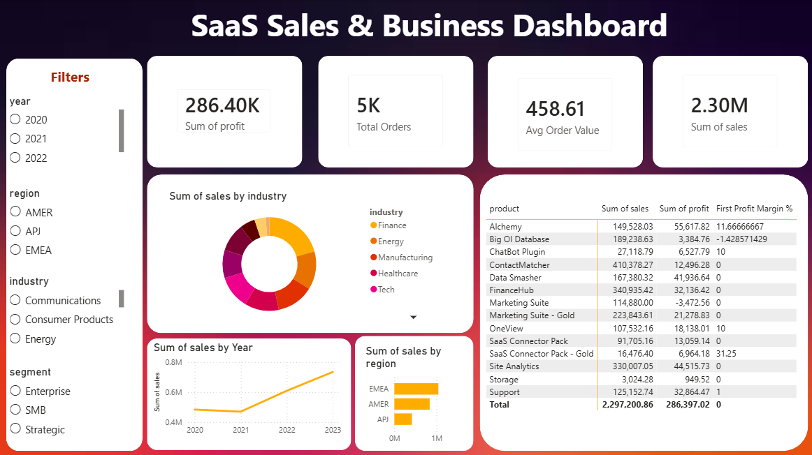

# SaaS Sales & Business Dashboard

I built this project to practice the full data analyst workflow — from raw data 
to a finished dashboard. The dataset is a fictional B2B SaaS company with ~10,000 
sales transactions between 2020 and 2023.

---

---

## What I did

**1. Data exploration (Python)**  
Loaded the CSV, checked column types, looked for nulls, and understood the structure.

**2. SQL analysis (SQLite)**  
Wrote queries to calculate KPIs like total revenue, profit by region, 
top products, and monthly trends.

**3. Python cleaning & charts (Pandas + Matplotlib)**  
Cleaned dates, calculated profit margins, and exported 5 charts.

**4. Power BI dashboard**  
Built an interactive dashboard with slicers for year, region, industry, and segment.

---

## Numbers at a glance

| | |
|---|---|
| Total Revenue | $2,297,200 |
| Total Profit | $286,397 |
| Profit Margin | 12.5% |
| Total Orders | 5,009 |
| Avg Order Value | $458.61 |

---

## What I found interesting

- EMEA brings in almost half the revenue, but APJ has very thin margins
- ContactMatcher is the top product by revenue, but Alchemy is far more profitable
- Marketing Suite is actually losing money despite decent sales volume
- Revenue grew steadily each year from 2020 to 2023

---

## Tools used

Python · SQL · Power BI · Git

---

## Dataset

[AWS SaaS Sales – Kaggle](https://www.kaggle.com/datasets/nnthanh101/aws-saas-sales)

---

## About me

I'm learning data analytics and this is one of my first end-to-end projects.  
Always open to feedback!

**Alif Al Fahim** · [GitHub](https://github.com/Alif-Al-Fahim)
